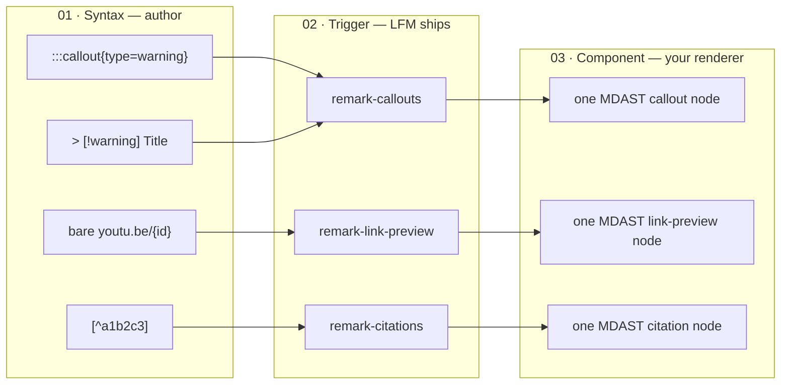

# @lossless-group/lfm

**Lossless Flavored Markdown** — MDX power without MDX's opinions.

A polyglot markdown pipeline where user-configured *syntax-triggers* normalize many authoring conventions (CommonMark + GFM, `remark-directive`, Obsidian callouts, hex-code citations, bare-URL embeds) into a single AST shape, ready for any framework's component pipeline. Plain `.md` files get the expressive power of MDX without the JSX-shaped lock-in.

One package, one import. Bundles unified, remark-parse, remark-gfm, remark-directive, and the LFM custom plugins.

**Live splash · feature gallery · changelog ·** [`lossless-group.github.io/lossless-flavored-markdown-package`](https://lossless-group.github.io/lossless-flavored-markdown-package/)

## The STC paradigm

LFM's whole pitch in three stages. Authors keep authoring in whatever syntax their tool prefers; a `remark` plugin matches the pattern (the *trigger*); the parser emits one canonical AST node a renderer dispatches to.



The polyglot point: **the two arrows landing on `remark-callouts`.** A directive callout and an Obsidian callout block produce the *same* MDAST node, so your `<Callout>` component renders one shape regardless of which authoring tool wrote the file. Adding a new authoring syntax means a new normalizer plugin — no consumer changes, no renderer rewrites.

This package owns stages 01 + 02 (and the matching catalog at stage 01). The component renderer is yours.

## When to reach for LFM

- You want MDX-class richness (callouts, citations, embeds, custom components) but **don't want JSX in your markdown**.
- You have authors using **multiple tools** (Obsidian, plain editors, Astro CMS) and want their syntax preferences to converge to one rendered output.
- You're building an **Astro / Svelte / Solid / vanilla** site and want a parser that produces a normalized AST your components can render directly.
- You need **build-time OG / link-preview enrichment** without a runtime network round-trip.

If you want JSX-in-markdown specifically, use MDX. If you want CommonMark only, use `remark-parse` directly. LFM sits between them.

## Install

**Canonical: from JSR** — [jsr.io/@lossless-group/lfm](https://jsr.io/@lossless-group/lfm)

Two equivalent ways to consume from JSR with pnpm:

```jsonc
// package.json — npm-alias form (works on any pnpm version)
{
  "dependencies": {
    "@lossless-group/lfm": "npm:@jsr/lossless-group__lfm@^0.3.0"
  }
}
```

```ini
# .npmrc — required for the npm-alias form to resolve
@jsr:registry=https://npm.jsr.io
```

```jsonc
// package.json — pnpm jsr: protocol form (newer pnpm)
{
  "dependencies": {
    "@lossless-group/lfm": "jsr:^0.3.0"
  }
}
```

**Mirror on GitHub Packages** ([github.com/lossless-group/lossless-flavored-markdown-package/pkgs/npm/lfm](https://github.com/lossless-group/lossless-flavored-markdown-package/pkgs/npm/lfm)) is published as parity but isn't the recommended consumption path. If you do want it, add `@lossless-group:registry=https://npm.pkg.github.com` plus a `${GITHUB_TOKEN}` auth line to `.npmrc` and install as `@lossless-group/lfm@^0.3.0`.

**Astro consumers:** the sister scaffold `@lossless-group/lfm-astro` lives at [`../lfm-astro/`](../lfm-astro/) — components and integration glue for Astro sites. Not yet published; track its progress in the [astro-knots changelog](https://github.com/lossless-group/astro-knots/tree/master/changelog) and use this package directly in the meantime.

## Usage

### Simple (recommended)

```ts
import { parseMarkdown } from '@lossless-group/lfm';

const tree = await parseMarkdown(markdownContent);
// tree is an MDAST — pass to your renderer
```

### As a remark preset

```ts
import { unified } from 'unified';
import remarkParse from 'remark-parse';
import { remarkLfm } from '@lossless-group/lfm';

const processor = unified()
  .use(remarkParse)
  .use(remarkLfm);

const mdast = processor.parse(content);
const tree = await processor.run(mdast);
```

### Cherry-pick plugins

```ts
import { remarkCallouts } from '@lossless-group/lfm';
```

## What's included

| Plugin | What it does |
|--------|-------------|
| remark-gfm | Tables, task lists, strikethrough, autolinks |
| remark-directive | `:::name{}` directive syntax parsing |
| remark-callouts | Obsidian `> [!type] Title` → directive normalization |
| remark-heading-ids | Stable, unique anchor id on every heading (`data.id`) + a document outline at `tree.data.headings`. One definition of what a fragment URL says, shared by every site. |
| remark-citations | Hex-code footnote renumbering + structured citation extraction |
| remark-lossless-wikilinks | Obsidian `[[Page]]` / `[[folder/Page#Section\|Display]]` → resolved `link` MDAST nodes via a site-supplied resolver. Internal vs external destinations are a per-site decision the package never bakes in. |
| remark-link-preview | `:::link-preview` / `:::link-rollup` directives → annotated AST nodes carrying `data.linkPreviewSpec` (the format taxonomy a renderer dispatches on) |
| remark-og-fetcher | Build-time OpenGraph fetcher that enriches link nodes with `LinkPreviewData` (cache-backed, configurable backend) |

The `remarkLfm` preset chains the first five together. All features enabled by default. `remarkOgFetcher` is opt-in (`enabled: true`) because it makes network calls; see **OG fetching** below.

The plugins above are the **triggers** in [the STC paradigm](#the-stc-paradigm) — each one matches its own family of authoring syntaxes and normalizes them into one canonical MDAST shape. Adding a syntax is adding a normalizer plugin; consumers don't change.

## Options

```ts
import { parseMarkdown } from '@lossless-group/lfm';

const tree = await parseMarkdown(content, {
  gfm: true,         // GFM features (default: true)
  directives: true,  // Directive syntax (default: true)
  callouts: true,    // Obsidian callout normalization (default: true)
  citations: true,   // Hex-code footnote renumbering (default: true)
  headingIds: true,  // Heading anchor ids + outline (default: true)
  // wikilinks: { resolver: ... }   // see Wikilinks section below — opt-in
});
```

## Wikilinks (Obsidian-style internal/external resolution)

Obsidian wikilinks (`[[Page]]`, `[[Page|Display]]`, `[[folder/Page#Section|Display]]`) are first-class authoring vocabulary in vaults — and dead text in standard Markdown. `remarkLosslessWikilinks` resolves them into proper `link` MDAST nodes against a **site-supplied resolver function**. The plugin owns the syntax (regex, MDAST splice, link node shape); each site owns its destinations (which prefix routes where, what's local vs external, what's intentionally parked).

This split exists because wikilink destinations are inherently per-site. The same `[[Vocabulary/Polyrepo]]` resolves to `lossless.group/more-about/polyrepo` from one site and `glossary.example.com/polyrepo` from another. Baking a default resolver into the package would be wrong for every consumer except the one we picked.

### Quick start

```ts
import { parseMarkdown } from '@lossless-group/lfm';

const tree = await parseMarkdown(content, {
  wikilinks: {
    resolver: (input) => {
      const path = input.path.toLowerCase();

      // Internal: same-site routes (path-only URL, isLocal: true).
      if (path.startsWith('essays/')) {
        const slug = path.slice('essays/'.length).replace(/\s+/g, '-');
        return {
          url: `/essays/${slug}`,
          isLocal: true,
          display: input.display ?? input.path.split('/').pop() ?? '',
        };
      }

      // External: full URLs (isLocal: false → target="_blank" added).
      if (path.startsWith('vocabulary/') || path.startsWith('concepts/')) {
        const slug = path.replace(/^[^/]+\//, '').replace(/\s+/g, '-');
        return {
          url: `https://www.lossless.group/more-about/${slug}`,
          isLocal: false,
          display: input.display ?? input.path.split('/').pop() ?? '',
        };
      }

      // No match → render as plain display text. The plugin handles
      // the fallback display string automatically.
      return null;
    },
    onUnresolved: (input) => {
      console.log(`[wikilinks] unresolved: ${input.raw}`);
    },
  },
});
```

### Resolver contract

```ts
import type {
  WikilinkResolverInput,
  WikilinkResolution,
  WikilinkOptions,
} from '@lossless-group/lfm';

// Input — produced by the plugin from one [[...]] match.
interface WikilinkResolverInput {
  path: string;          // "Vocabulary/Build Systems"
  anchor: string | null; // "Section Heading" or null
  display: string | null;// author-supplied or null
  raw: string;           // the literal "[[...]]"
}

// Output — used verbatim to build the <a> node, OR null to render
// the wikilink as plain display text (no anchor, no class).
interface WikilinkResolution {
  url: string;          // "/essays/foo" or "https://..."
  isLocal: boolean;     // true → wikilink--local class, no target=_blank
  display: string;      // final visible text
  classes?: string[];   // extra CSS classes appended to the base
}
```

### Rendering

Resolved wikilinks emit standard `link` MDAST nodes with `data.hProperties.class` set to `wikilink wikilink--local` or `wikilink wikilink--external`. External wikilinks also get `target="_blank" rel="noopener noreferrer"`. **No custom MDAST node type, no custom renderer component required** — the regular link branch in your AstroMarkdown / rehype-react / etc. pipeline handles them.

```html
<!-- External -->
<a class="wikilink wikilink--external"
   target="_blank" rel="noopener noreferrer"
   href="https://www.lossless.group/more-about/build-systems">Build Systems</a>

<!-- Internal -->
<a class="wikilink wikilink--local"
   href="/essays/foo-bar">Foo Bar</a>
```

### What gets matched (and what doesn't)

The plugin walks `text` MDAST nodes only. Wikilink syntax inside fenced code blocks, inline code, and HTML stays literal:

````markdown
This [[Vocabulary/Polyrepo]] resolves.

But ` [[concepts/foo]] ` (inline code) does NOT.

```ts
const ex = '[[Tooling/Bazel]]'; // also untouched — code fence
```
````

### When the resolver returns `null`

Operating principle: *supporting 40% of intended wikilinks is better than supporting none.* Unresolved wikilinks render as plain prose — just the display string (or path's last segment, with `.md` stripped and hyphens turned to spaces). No `<a>`, no class, no markup hint. The optional `onUnresolved` callback fires once per unresolved match — typical use is piping into a build-time audit log.

### A worked example: per-site resolver with rule arrays

The recommended pattern for non-trivial sites is to declare prefix rules as data, not as `if`-branches in the resolver:

```ts
const PREFIX_RULES = [
  { prefix: 'essays/',     template: '/essays/{slug}',                                 isLocal: true },
  { prefix: 'tooling/',    template: 'https://www.lossless.group/toolkit/{slug}',      isLocal: false },
  { prefix: 'vocabulary/', template: 'https://www.lossless.group/more-about/{slug}',   isLocal: false },
  { prefix: 'concepts/',   template: 'https://www.lossless.group/more-about/{slug}',   isLocal: false },
];

const slugify = (s: string) =>
  s.split('/').map(seg => seg.trim().toLowerCase().replace(/\s+/g, '-')).join('/');

const resolver = (input: WikilinkResolverInput): WikilinkResolution | null => {
  const lower = input.path.toLowerCase();
  for (const rule of PREFIX_RULES) {
    if (lower.startsWith(rule.prefix)) {
      const tail = lower.slice(rule.prefix.length);
      return {
        url: rule.template.replace('{slug}', slugify(tail)),
        isLocal: rule.isLocal,
        display: input.display ?? input.path.split('/').pop() ?? '',
      };
    }
  }
  return null;
};
```

Adding a destination is then six lines in the rule array. The reference implementation in `mpstaton-site` adds two more rule shapes (`ExactRule` for one-off overrides, `DeferredRule` for "deliberately parked, don't keep showing up as untouched"). Both are optional.

## OG fetching (build-time)

`remarkOgFetcher` walks the tree, finds external links and link-preview directives, fetches their OpenGraph metadata via a configurable backend, and annotates the AST with `LinkPreviewData`. Runs at parse time so renderers have everything they need with no client-side round-trip — popovers and previews appear instantly on hover.

```ts
import { unified } from 'unified';
import remarkParse from 'remark-parse';
import { remarkLfm, remarkOgFetcher } from '@lossless-group/lfm';

const processor = unified()
  .use(remarkParse)
  .use(remarkLfm)
  .use(remarkOgFetcher, {
    enabled: true,
    backend: 'direct',         // or 'opengraph-io' (with apiKey)
    timeout: 5000,             // ms — don't bump above 10s, one unreachable URL stalls the build
    maxConcurrent: 4,
    ttl: 60 * 60 * 24 * 7,     // 7 days, in seconds
    failCacheTtl: 60 * 60 * 24 // 1 day for failed fetches, in seconds
  });
```

Sites that need direct cache access import `OGCache`, `OGDispatcher`, `createOGDispatcher`, or `loadOGCache` for inspection or invalidation. The annotated `LinkPreviewData` shape aligns with the canonical Sources schema in `cite-wide` so a future "promote to canonical" pipeline is additive rather than a rename.

## Citations

Footnotes with hex-code identifiers get renumbered to display indices and lifted into a structured citation dataset on `tree.data.citations`:

```markdown
Global aging is accelerating.[^a1b2c3]
Healthcare costs are rising.[^d4e5f6]

[^a1b2c3]: 2024. [Population Ageing](https://example.com). Published: 2024-07-11
[^d4e5f6]: 2025. [Cost Drivers](https://example.com). Published: 2024-11-22
```

After `parseMarkdown(content)`, the MDAST is mutated in place:

- `footnoteReference` nodes carry `node.data.citationIndex` (the display number, e.g. `1`, `2`) and `node.data.citationHex` (the original identifier).
- `footnoteDefinition` nodes are removed from the tree.
- The full citation dataset (title, URL, source domain, published / updated dates, raw text, parsed flag) lives at `tree.data.citations.ordered` for a Sources-style component to render at the bottom of the article.

## Bare-link auto-unfurl (catalog ships now, plugin pending)

A URL on its own line — paragraph with a single autolink child — is the LFM signal that the author wants the URL rendered as an embedded player or rich card rather than a clickable link. The classification + dispatch pipeline:

```
bare URL paragraph                            // CommonMark + GFM autolink pass
       │
       ▼
remark-bare-link plugin (forthcoming)
       │  reads src/plugins/Bare-Link-Provider-Catalog.md
       │  matches host + path (+ query) against ordered providers
       ▼
leafDirective { provider, id, url, kind }     // standard MDAST directive node
       │
       ▼
renderer dispatches by directive name         // YouTubeEmbed, VimeoEmbed, etc.
```

**The catalog file** — `src/plugins/Bare-Link-Provider-Catalog.md` — ships with this package starting at 0.2.2. Its YAML frontmatter is the canonical record of supported providers; the body explains the matching rules. v0.2.2 catalog includes four `stable` providers:

| Provider | URL shapes | Directive | Component name |
|---|---|---|---|
| `youtube-video` | `youtu.be/{id}`, `youtube.com/watch?v={id}` | `::youtube-video` | `YouTubeEmbed` |
| `youtube-short` | `youtube.com/shorts/{id}` | `::youtube-short` | `YouTubeShortsEmbed` |
| `youtube-playlist` | `youtube.com/playlist?list={id}` | `::youtube-playlist` | `YouTubePlaylistEmbed` |
| `vimeo` | `vimeo.com/{id}` (incl. channels + unlisted hash), `player.vimeo.com/video/{id}` | `::vimeo` | `VimeoEmbed` |

Plus `planned` entries for Vimeo additions, Loom, Spotify, and SoundCloud — kept in the catalog as documented intent.

**Until `remark-bare-link` lands**, sites can run the same classification at render time. Reference implementation: `sites/mpstaton-site/src/lib/markdown/classify-bare-link.ts` in the [astro-knots monorepo](https://github.com/lossless-group/astro-knots) — a ~100-line pure classifier with `getBareLinkUrl(node)` (MDAST autolink shape detector) and `classifyBareLink(url)` (host/path/query matchers). It mirrors the catalog's matchers in TypeScript so consuming sites have the same dispatch behavior the future plugin will produce.

**Inline links stay autolinks.** The detector requires the paragraph to have *exactly one child* that's a `link` whose visible text equals its URL — so `Check this out https://youtu.be/...` mid-sentence stays a clickable link, not an embed. CommonMark's paragraph rule does the blank-line gating for free.

## Types

```ts
import type {
  LfmComponentNode,    // Normalized node from any trigger syntax
  LfmCalloutNode,      // Callout directive node
  Citation,            // Single citation: index, hex, title, url, source, dates, raw
  CitationsData,       // tree.data.citations shape: { ordered, byHex, warnings }
  RemarkLfmOptions,    // Preset options
  LinkPreviewData,     // Annotated link metadata (canonical Sources-aligned)
  LinkPreviewSpec,     // What remark-link-preview stamps on directive nodes
  OGFetchOptions,      // remarkOgFetcher options (backend, ttl, timeout, etc.)
  OGFetchResult,       // What an OG backend returns
  OGBackendName,       // 'direct' | 'opengraph-io' | …
} from '@lossless-group/lfm';
```

## Roadmap

Shipped at 0.2.x — directives, callouts, citations, link-preview annotation, OG fetching, the bare-link catalog.

### Incremental — extending the trigger catalog

- **remark-bare-link** — the parse-time plugin that consumes the bundled catalog and emits leaf directives (sites currently classify at render time)
- **remark-backlinks** — `[[wikilink]]` resolution
- **remark-toc** — auto-generated table of contents
- **remark-code-components** — code fence identifiers → component routing (mermaid, etc.)

### Paradigm-completing — broader polyglot reach

- **Markdoc `` normalization** — converge Markdoc-flavored content into the same AST
- **MDX-lite `<Component />` normalization** — accept MDX-shaped author syntax without JSX execution

That separation matters: incremental plugins extend what triggers exist; the polyglot work extends *which authoring conventions* converge to the canonical AST.

See the full spec: [Codifying a Comprehensive Extended Markdown Flavor and Shared Package](https://github.com/lossless-group/astro-knots/blob/master/context-v/specs/Codifying-a-Comprehensive-Extended-Markdown-Flavor-and-Shared-Package.md)

## What shipped when

See [`changelog/`](./changelog/) for entry-by-entry notes following the [Lossless changelog conventions](https://github.com/lossless-group/lossless-skills/tree/main/changelog-conventions). The same entries render on the [live splash](https://lossless-group.github.io/lossless-flavored-markdown-package/changelog/) with full-text search, tags, and date sorting.

## See also

- **Live splash** — [`lossless-group.github.io/lossless-flavored-markdown-package`](https://lossless-group.github.io/lossless-flavored-markdown-package/) · the package's own GitHub Pages presence: STC diagram, feature gallery, changelog, context-v notes, full-text search
- **Design system** — [`splash/DESIGN.md`](./splash/DESIGN.md) · token inventory + Ideogram creative brief for OG image generation, formatted to the [Google `@google/design.md`](https://github.com/google-labs-code/design.md) spec
- **Spec** — [Codifying a Comprehensive Extended Markdown Flavor and Shared Package](https://github.com/lossless-group/astro-knots/blob/master/context-v/specs/Codifying-a-Comprehensive-Extended-Markdown-Flavor-and-Shared-Package.md) · the full specification this package implements
- **Sister scaffold** — `@lossless-group/lfm-astro` (forthcoming) · components and integration glue for Astro consumers

## License

MIT
