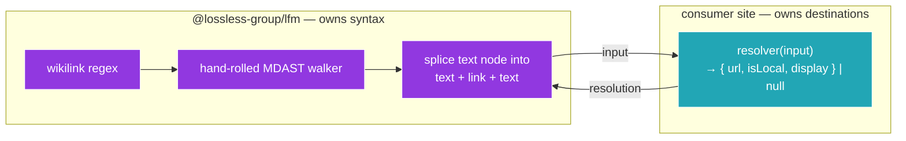
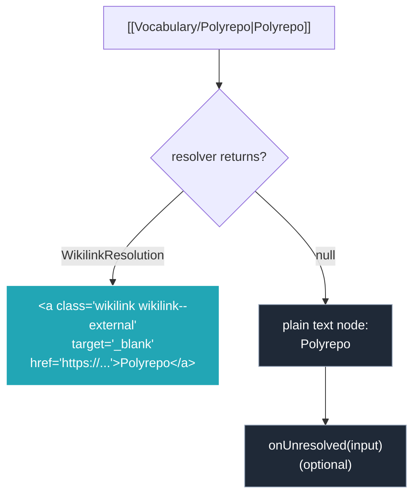
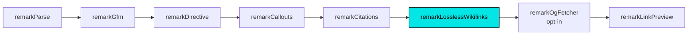

## Why Care?

LFM has supported Obsidian-flavored callouts (`> [!info]`) since 0.1.0. The other half of Obsidian's authoring vocabulary — **wikilinks** — has been conspicuously missing. Authors writing in an Obsidian vault use `[[Vocabulary/Polyrepo|Polyrepo]]` and `[[concepts/Naming Conventions]]` the way most of us use ordinary markdown links. When that content shipped to a static site, the wikilinks rendered as raw `[[...]]` text. Reader sees `[[Vocabulary/Polyrepo|Polyrepo]]` mid-paragraph and thinks "broken site."

0.3.0 fixes it — but with a deliberate constraint that took some work to land:

**LFM never decides where a wikilink points.** A wikilink like `[[Vocabulary/Polyrepo]]` resolves to `lossless.group/more-about/polyrepo` from one site, `glossary.example.com/polyrepo` from another, and `/notes/polyrepo` (local route) from a third. Each site has different content collections, different external destinations, different "this is local vs external" rules. Picking a default would be wrong for every consumer except the one we picked.

So the new plugin takes a `resolver` function from the consumer and asks it to map each wikilink to a URL. The plugin owns the *syntax*: regex parsing, MDAST splice, link-node shape, code-fence skipping. The site owns the *destinations*: which prefix routes where, what's local vs external, what's intentionally parked.



Rendered output for resolved wikilinks is a **standard `link` MDAST node** — no custom node type, no custom renderer component. Whatever your AstroMarkdown / rehype-react / Markdoc surface does for regular links also handles wikilinks. The only change is two CSS classes (`wikilink wikilink--local`, `wikilink wikilink--external`) on the anchor for sites that want to style them.

## What's New?

### `remarkLosslessWikilinks` plugin

Walks every `text` MDAST node and replaces wikilink syntax matches in place. Runs after parse, before render. Supported syntax shapes:

| Authored | Resolves to |
|---|---|
| `[[Page]]` | `<a href="resolved-url">Page</a>` |
| `[[Page\|Display]]` | `<a href="resolved-url">Display</a>` |
| `[[folder/Page]]` | `<a href="resolved-url">Page</a>` (display = last segment, deslugified) |
| `[[folder/Page\|Display]]` | `<a href="resolved-url">Display</a>` |
| `[[Page#Section]]` | `<a href="resolved-url#section">Page</a>` |
| `[[folder/Page#Section\|Display]]` | `<a href="resolved-url#section">Display</a>` |

Wikilinks inside fenced code blocks, inline code, and HTML stay literal — the walker skips those node types. Documenting wikilink syntax in code examples now works the way you'd expect.

### Quick-start

```ts
import { parseMarkdown } from '@lossless-group/lfm';

const tree = await parseMarkdown(content, {
  wikilinks: {
    resolver: (input) => {
      const path = input.path.toLowerCase();

      if (path.startsWith('essays/')) {
        const slug = path.slice('essays/'.length).replace(/\s+/g, '-');
        return {
          url: `/essays/${slug}`,
          isLocal: true,                    // → wikilink--local class, no target=_blank
          display: input.display ?? input.path.split('/').pop() ?? '',
        };
      }

      if (path.startsWith('vocabulary/') || path.startsWith('concepts/')) {
        const slug = path.replace(/^[^/]+\//, '').replace(/\s+/g, '-');
        return {
          url: `https://www.lossless.group/more-about/${slug}`,
          isLocal: false,                   // → wikilink--external + target=_blank
          display: input.display ?? input.path.split('/').pop() ?? '',
        };
      }

      return null;                          // unresolved → plain text fallback
    },
    onUnresolved: (input) => {
      console.log(`[wikilinks] unresolved: ${input.raw}`);
    },
  },
});
```

### Resolver contract

```ts
import type {
  WikilinkResolverInput,
  WikilinkResolution,
  WikilinkOptions,
} from '@lossless-group/lfm';

interface WikilinkResolverInput {
  path: string;          // "Vocabulary/Build Systems" — original casing
  anchor: string | null; // "Section Heading" or null (no `#`)
  display: string | null;// author-supplied, or null
  raw: string;           // the literal "[[...]]"
}

interface WikilinkResolution {
  url: string;          // "/essays/foo-bar" or "https://..."
  isLocal: boolean;     // drives class + target attributes
  display: string;      // final visible anchor text
  classes?: string[];   // extra CSS classes after the base `wikilink wikilink--{local|external}`
}

interface WikilinkOptions {
  resolver: (input: WikilinkResolverInput) => WikilinkResolution | null;
  onUnresolved?: (input: WikilinkResolverInput) => void;
}
```

### Plain-text fallback for unresolved wikilinks

Operating principle: ***supporting 40% of intended wikilinks is better than supporting none.*** When the resolver returns `null`, the plugin emits a plain `text` MDAST node containing only the display string (or the path's last segment, with `.md` stripped and hyphens turned to spaces). No `<a>`, no class, no markup hint that anything was ever a wikilink. The reader sees ordinary prose and isn't punished for an incomplete config.



The `onUnresolved` callback is the suggested integration point for an audit log — a per-build report of paths that fell through every rule. The reference site (`mpstaton-site`) pipes it into a regenerate-on-demand markdown file that grouped 354 unique wikilink paths across 15 prefixes; 208 of them resolved on the first pass via 7 prefix rules. The remaining 146 either matched explicitly-deferred prefixes (no public destination yet) or were bare wikilinks pointing at vault-root stubs. None of them broke the page.

### Plugin pipeline order

`remarkLosslessWikilinks` slots between `remarkLosslessCallouts` and `remarkOgFetcher` in the `remarkLfm` preset. The order matters for two reasons:



1. **After callouts** so wikilinks inside `> [!info]` callout bodies still resolve. (The plan codified in `[[Maintain-Lossless-Markdown-and-Extended-Markdown-Render-Pipeline]]` §7 — callouts are containers; everything LFM does should work nested inside one.)
2. **Before the og-fetcher and link-preview annotators** so wikilinks-resolved-to-external-URLs can pick up OG metadata and link-preview hover cards on the same equal footing as ordinary markdown links.

Pass `wikilinks: false` (or simply omit it) to skip the plugin entirely. It's opt-in by default precisely because no resolver = no destinations = nothing to do.

## A Real Resolver

The reference implementation in `mpstaton-site` is the most opinionated example. Three rule shapes carry it:

```ts
// PrefixRule — most common
{ prefix: 'tooling/',    template: 'https://lossless.group/toolkit/{slug}' }
{ prefix: 'vocabulary/', template: 'https://lossless.group/more-about/{slug}' }
{ prefix: 'essays/',     template: '/essays/{slug}', isLocal: true }

// ExactRule — one-off overrides
{ path: 'projects/special-case', url: 'https://example.com/somewhere-else' }

// DeferredRule — deliberately parked, won't pollute the audit
{ prefix: 'organizations/', reason: 'No public destination yet' }
```

The resolver iterates exact rules first (overrides win), then prefix rules (first match in declared order wins), then deferred prefixes (return `null`, don't log to audit), then unconditionally `null` for everything else. ~60 lines total. It's a worthwhile reference even for sites that just need a flat URL map; the data-as-config pattern scales without rewriting the resolver function as the rule count grows.

Full reference: `sites/mpstaton-site/scripts/wikilink-rules.ts` in the astro-knots repo.

## What's Coming

The other planned work for 0.3.0 — renaming the existing four plugins (`remarkCallouts`, `remarkCitations`, `remarkLinkPreview`, `remarkOgFetcher`) into the `remarkLossless*` namespace, plus renaming `createLfmProcessor()` → `lfmPipeline()` — is **deferred to a future minor**. Today's release is additive only: every existing import still works exactly as before. The new plugin is the only behavioral change. We'll bundle the namespace cleanup with the next batch of changes that warrants a coordinated breaking release.

## Related

- `[[Wikilink-Resolution-System]]` (astro-knots/context-v/plans) — the architectural plan that drove this feature.
- `[[mpstaton-site/2026-05-08_02]]` — the consumer-side story: audit → rules → plugin → live rendering.
- 0.2.3 (`[[2026-05-08_01]]`) — earlier today, callout regex fixes (multi-line, hyphen-friendly types, foldable syntax).
