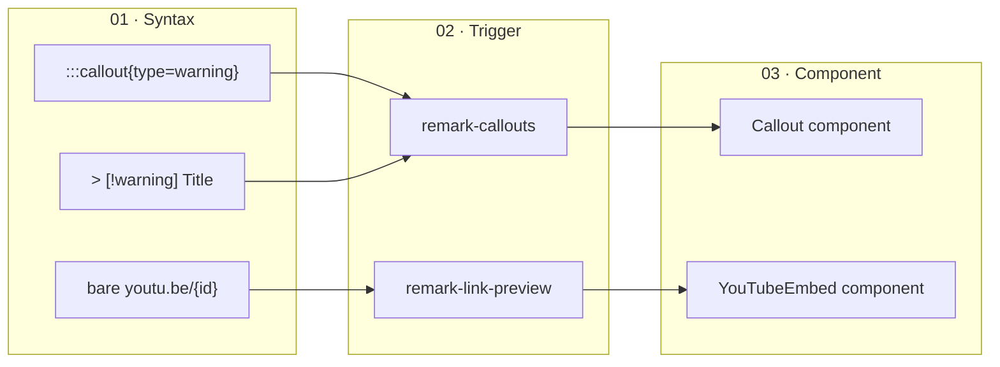

# lfm/splash

GitHub Pages splash for [`@lossless-group/lfm`](https://jsr.io/@lossless-group/lfm). The package's own public face — distinct from the eventual marketing site, which will live elsewhere with its own custom domain. The directory is named `splash/` precisely to keep that linguistic space open.

**Live:** <https://lossless-group.github.io/lossless-flavored-markdown-package/>

## What LFM is, briefly

Lossless Flavored Markdown is a polyglot extended-markdown pipeline. Authors write in whatever syntax their tool prefers — Obsidian callouts (`> [!warning]`), CommonMark directives (`:::callout{type=warning}`), hex-code citations (`[^a1b2c3]`), bare URLs that should auto-unfurl as embeds — and `remark` plugins normalize every variation onto **one canonical MDAST shape** the renderer dispatches against. One AST, many authoring conventions, ready for any framework.

Authors keep authoring; the parser handles the rest.

## What the splash is

A small Astro site that:

- Greets visitors with an asymmetric hero: copy on the left, the STC paradigm diagram dominant on the right.
- Renders the package's `changelog/` and `context-v/` directories as readable archives — sorted by date by default, sortable by created/published/title, with tags rows that wrap.
- Ships full-text search via Pagefind from day one. Press `/` from anywhere to focus the search box; results filter by `kind:Changelog | kind:Context` and per-tag facets.
- Toggles between three modes — light (default, "writer's mode"), dark ("operator"), vibrant ("demo") — persisted to localStorage with a pre-paint script that resolves the choice before first render so there's no FOUC.
- Deploys for free off GitHub Pages on every push to `main`.

It is **not** the eventual marketing site. When that exists, it'll live elsewhere; the splash stays put as the source repo's own Pages presence.

## The STC paradigm

LFM's whole pitch in three stages: authors keep authoring in whatever syntax their tool prefers, a `remark` plugin matches the pattern (the *trigger*), and the parser emits one canonical AST node a renderer dispatches to. **Many syntaxes converge to one shape.**



The polyglot point is the two arrows landing on `remark-callouts`: an Obsidian callout block and a directive block produce the **same MDAST node**, so your `<Callout>` component renders one shape regardless of which authoring tool wrote the file. Adding a new authoring syntax means a new normalizer plugin — no consumer changes, no renderer rewrites.

The hero uses an interactive `StcDiagram.astro` component for this flow with a worked-example panel underneath; this README diagram is the static counterpart.

## Visual identity

**Manuscript meets parser.** The aesthetic deliberately diverges from sibling Lossless splashes (memopop-site, content-farm/splash) — light is the default mode, the display face is a serif (Newsreader), the brand spine is ink-violet + sienna + moss instead of cyan, the hero is asymmetric, and cards have squarer corners with hairline borders and printer's-mark corner ticks. No glassmorphism, no glow shadows.

The full design system — Tier-1 + Tier-2 tokens, three-mode contract, locked vs. free axes, the Ideogram creative brief for OG images — lives in [`DESIGN.md`](./DESIGN.md), formatted to the [Google `@google/design.md`](https://github.com/google-labs-code/design.md) spec.

## Package isolation

LFM publishes to JSR (canonical) and a GitHub Packages npm mirror. The splash sits in the same repo. Both publish channels use **explicit allowlists** that exclude `splash/`, so nothing under it ever ships:

| Channel | Defined in | Allowlist |
|---|---|---|
| JSR (canonical) | `deno.json` → `publish.include` | `src/**/*.ts`, `src/**/*.md`, `deno.json`, `LICENSE`, `README.md` |
| npm mirror | `package.json` → `"files"` | `src`, `dist`, `README.md`, `LICENSE` |
| Build (`tsup`) | `tsup.config.ts` → `entry` | hard-coded `src/...ts` paths |

`"private": true` in `splash/package.json` is defense-in-depth — it keeps this directory off any registry even if `npm publish` were run from inside it. The boundary is the allowlists; `private` is the suspenders to that belt.

## Local dev

```bash
pnpm install --ignore-workspace
pnpm dev
```

The dev server respects `base: '/lossless-flavored-markdown-package/'`, so visit
<http://localhost:4321/lossless-flavored-markdown-package/>.

> `--ignore-workspace` keeps the splash from joining any parent monorepo workspace; it installs its own deps independently.

> **Search note:** Pagefind builds its index from `dist/` at build time. In `pnpm dev` the search box mounts but reports the index isn't available — run `pnpm build && pnpm preview` to exercise search end-to-end locally.

## Build

```bash
pnpm build
pnpm preview
```

Static output lands in `dist/`, including the Pagefind index at `dist/pagefind/`.

## Deploy

`.github/workflows/pages.yml` (at the repo root) builds `splash/` on every push to `main` and deploys via `actions/deploy-pages@v4`, with `actions/configure-pages@v5` set to `enablement: true` so the workflow bootstraps Pages on first run. After the first deploy, set the GitHub Pages source to **"GitHub Actions"** in repo settings.

## Where things live

| Path | Purpose |
|---|---|
| `src/pages/index.astro` | Hero, STC diagram, feature gallery, latest changelog teaser |
| `src/pages/search.astro` | Full-panel Pagefind search page |
| `src/pages/changelog/` | Sortable list + detail routes for `../changelog/` |
| `src/pages/context-v/` | Sortable list (grouped by subdirectory) + detail routes for `../context-v/` |
| `src/components/StcDiagram.astro` | The Syntax → Trigger → Component three-stage flow with collection-driven worked-example panel |
| `src/components/SearchBox.astro` | Compact (header popover) and full (search page) Pagefind UI variants |
| `src/components/SortControls.astro` | Chip group + direction toggle, persists per-page in localStorage |
| `src/components/FeatureCard.astro` | Curated feature gallery card |
| `src/components/Header.astro` · `MetaTags.astro` · `ModeToggle.astro` | Page chrome |
| `src/content/feature-highlights/*.md` | Curated cards in the feature gallery |
| `src/content/stc-examples/*.md` | Worked examples driving the STC diagram's "Live example" panel |
| `src/content.config.ts` | Lenient collection schemas; reads `../changelog` and `../context-v` |
| `src/loaders/frontmatter.ts` | Tiny YAML-subset frontmatter parser (~150 lines, no `gray-matter`) |
| `src/lib/seo.ts` | Static SEO copy + named OG image entries (banner / wide / square / portrait) |
| `src/lib/date.ts` | `toDate(unknown)` defensive helper + format helpers |
| `src/layouts/BaseLayout.astro` | Tokens, fonts, head, body shell, mode pre-paint script |
| `src/styles/theme.css` | Two-tier tokens + three-mode contract |
| `src/styles/prose.css` | Long-form rendering for changelog + context-v body content |
| `DESIGN.md` | Design system per the Google design.md spec; includes Ideogram brief for OG image generation |

### Path aliases

`tsconfig.json` declares: `@components/*`, `@layouts/*`, `@loaders/*`, `@lib/*`, `@styles/*`, `@content/*`, `@pages/*`, `@/*`.

## How to update content

| To update… | Edit… |
|---|---|
| Hero copy + brand line | `src/pages/index.astro` (and `src/lib/seo.ts` for the description used by OG / preview cards) |
| Feature gallery | Add or edit a `.md` file under `src/content/feature-highlights/` |
| STC worked examples | Add or edit a `.md` file under `src/content/stc-examples/` (set `featured: true` to drive the hero) |
| Changelog entries | Add a file to `../changelog/<YYYY-MM-DD_NN.md>` per the Lossless changelog conventions |
| Context-v notes | Add a file under `../context-v/` per the Lossless context-vigilance conventions |
| OG / share images | Drop new variants into `src/lib/seo.ts` `OG_IMAGES`; flip `DEFAULT_OG` to point at the one you want as the global default |
| Visual identity | `src/styles/theme.css` (tokens) + `DESIGN.md` (the rationale layer) |

### Feature gallery card frontmatter

```yaml
---
title: remark-callouts
lede: One-sentence pitch.
order: 40              # lower sorts first; alphabetical tiebreak
status: Stable         # Stable | Beta | Alpha | Experiment
icon: 📣               # emoji or path under /public
featured: true         # featured cards take a wider tile
tags: [Callouts, Obsidian]
---

Long-form description in markdown. Renders as the card's expanded body.
```

`order` ties are broken alphabetically by filename — never throws.

### STC worked-example frontmatter

```yaml
---
title: Video Embeds
order: 10
featured: true        # the index hero renders the featured one
syntax_label: bare URL or directive
syntax_examples:
  - kind: bare
    code: 'youtu.be/share={id}'
  - kind: directive
    code: ':::youtube-share[https://youtu.be/jCe2wg1ulus]'
parse_file: src/plugins/remark-link-preview.ts
component_file: components/YoutubeShareEmbed--Base.astro
status: live          # live | planned
---

Body renders below the example panel.
```

## Search, sort, and tags

- **Search** — Pagefind builds the static index against `dist/` at build time; the runtime is ~95KB of WASM. Press `/` to focus from anywhere. The header popover and the `/search/` page are the same UI in compact and full variants. Filter facets: `kind:Changelog`, `kind:Context`, plus one filter per tag.
- **Sort** — both `/changelog/` and `/context-v/` carry a `<SortControls>` row with chips for *Modified · Created · Published · Title* and a direction toggle. Default is `date_modified` descending. The server pre-sorts to match so the static HTML is correct even with JS off; the SortControls component reorders client-side once mounted, persisting the choice in `localStorage`.
- **Tags row** — every entry preview renders its full tag list as a wrapping row beneath the lede. No slice limit; the row expands downward as needed.

## OG / share images

The default `og:image` is the 4:3 ImageKit-hosted banner generated via Ideogram per the brief in [`DESIGN.md`](./DESIGN.md). Three other variants — `wide` (≈2:1, for Twitter/X large cards), `square` (1:1, for `summary` cards / avatars), `portrait` (≈9:16, for Stories / mobile) — are available as named entries in `src/lib/seo.ts#OG_IMAGES`. Pages can swap by passing `ogImage*` props to `BaseLayout`.

The first round of banners is the visual aesthetic. A future iteration will leave headroom for an SVG title overlay so the banner itself can render "Lossless Flavored Markdown: <subtitle>" compositionally rather than relying on the platform's preview layer to render the page title.

## See also

- **Habit:** *"Maintain a Github Splash Page for each Repo"* in `lossless-monorepo/context-v/habits/` — the *why* behind splash pages
- **Skill:** `maintain-splash-pages` in [`lossless-skills`](https://github.com/lossless-group/lossless-skills) — the *how*: scaffolding, package isolation, search, sort, tags, divergence-by-design
- **Reference splashes:** `content-farm/splash/` (canonical, pseudomonorepo variant), `ai-labs/memopop-ai/apps/memopop-site/` (first instance, predates the habit)
- **Search exploration:** `astro-knots/context-v/explorations/Implementing-Full-Text-Search-by-Default.md` — establishes Pagefind as the default for Astro Knots; this splash is the second confirmed instance
- **Design system:** [`DESIGN.md`](./DESIGN.md) — token inventory + Ideogram creative brief
